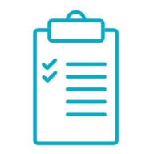

# To-do-list

Welcome to To-do-list!

If you are looking for a place to save your to-do list this is the place for you!

## Preview of the website 

Click here to see To-do-list: [To-do-list demo](https://izabelanowak.github.io/to-do-list/)

## Description
Here is a simple list of tasks. Here you can add your tasks by typing the content into the text field, and then clicking the button or confirming enter! Your tasks will appear in the list below. With the green button you can mark your task as completed or delete it after pressing the red button.

## Used technologies:

-   Semantic HTML
-   CSS
-   BEM naming
-   Media queries
-   Flexbox
-   Grid
-   ES6+ features

## How to use
See gif below to see how to-do-list works!

1. Add new task by clicking into button (Dodaj zadanie) or just click enter!

2. You can set your task as done by click in green button, or remove task by clicking in red button!

3. See how to-do list works on phones!

